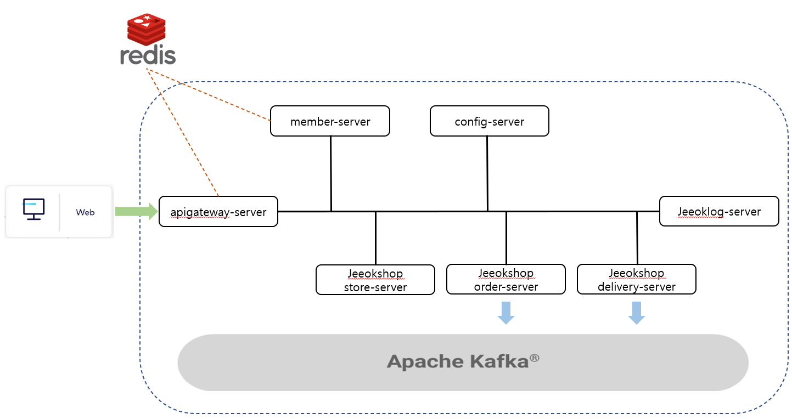

# [JEEOK-PROJECT] Spring Cloud 를 활용한 Back-End 개발 프로젝트

## Client Server
| 서버 | 설명 |
| --- | --- |
| [JEEOK-CLIENT-VUE](https://github.com/heechul90/project-jeeok/tree/main/jeeok-client-vue) | Front end 서버 |

## API Gateway Server
| 서버 | 설명 |
| --- | --- |
| [APIGATEWAY-SERVER](https://github.com/heechul90/project-jeeok/tree/main/apigateway-server) | 모든 요청을 통과하는 API 라우팅 서버 |

## Config Server
| 서버 | 설명 |
| --- | --- |
| [CONFIG-SERVER](https://github.com/heechul90/project-jeeok/tree/main/config-server) | 각 서버의 application.yml을 관리하는 서버 |

## rest api server
| 서버 | 설명 |
| --- | --- |
| [MEMBER-SERVER](https://github.com/heechul90/project-jeeok/tree/main/member-server) | JWT 토큰을 이용한 로그인/로그아웃, 회원가입 및 회원 관리 |
| [JEEOKLOG-SERVER](https://github.com/heechul90/project-jeeok/tree/main/jeeoklog-server) | 게시물 CRUD 개발 |
| [JEEOKSHOP-STORE-SERVER](https://github.com/heechul90/project-jeeok/tree/main/jeeokshop-store-server) | 관리자 및 매니저 스토어, 상품 관리 기능 개발   유저 스토어 목록 확인 및 찜하기 등록 기능 개발 |
| [JEEOKSHOP-ORDER-SERVER](https://github.com/heechul90/project-jeeok/tree/main/jeeokshop-order-server) | 관리자 및 매니저 주문 관리 기능   유저 상품 주문 기능 |
| [JEEOKSHOP-DELIVERY-SERVER](https://github.com/heechul90/project-jeeok/tree/main/jeeokshop-delivery-server) | 주문시 배송 추가 기능   관리자 배송 관리 기능 |

## 사용 기술스텍
| 기술스택 | 개발환경 |
| --- | --- |
| Spring | - String Boot 2.7.x   - Java 11   - Gradle   - Spring Web Mvc   - Spring Security |
| Spring Cloud | - Eureka   - Gateway   - Config   - OpenFeign |
| Authenticate | - JWT (Json Web Token) |
| ORM | - JPA   - Querydsl |
| Database | - MariaDB   - Redis |
| Test | - Spring RestDocs   - JUnit5   - Mock |
| Message Queue | - Kafka |

## 시스템 아키텍처

## 프로젝트 정책
- 레이어 참조 방향 청책
  - 클라이언트(view) 레이어 -> 웹(controller) 레이어 -> 비즈니스(service) 레이어 -> 데이터베이스(repository) 레이어 순으로 참조한다.
  - 역참조 및 두단계 뛰어넘는 참조는 금지한다.
  - 
- 객체지향 프로그래밍의 5가지(SOLID) 설계 원칙을 준수하도록 노력한다.
  1. 단일 책임의 원치(SRP, Single Responsibility Principle)
     - 하나의 모듈은 한 가지 책임을 가져야 한다.
  2. 개방 폐쇄 원칙 (OCP, Open-Closed Principle)
     - 확장에 대해 열려있고 수정에 대해서는 닫혀있어야 한다.
  3. 인터페이스 분리 원칙 (ISP, Interface segregation principle)
     - 목적과 관심이 각기 다른 클라이언트가 있다면 인터페이스를 통해 적절하게 분리한다.
  4. 리스코프 치환 원칙 (LSP, Liskov Substitution Principle)
     - 하위 타입은 상위 타입을 대체할 수 있어야 한다.
  5. 의존 역전 원칙 (DIP, Dependency Inversion Principle)
    - 고수준 모듈은 저수준 모듈의 구현에 의존해서는 안 되며, 저수준 모듈이 고수준 모듈에서 정의한 추상 타입에 의존해야 한다.

- 테스트는 통합테스트(Integration), 단위테스트(Mock), 레포지토리테스트(DataJpaTest)로 나우어 진행한다.
  - controller : 통합테스트, 모든 bean을 올리고 운영환경과 가장 유사하게 테스트를 한다.
  - service : 단위테스트, 진행하고자 하는 테스트에만 집중하여 테스트한다.
  - repository : 레포지토리테스트, 관련된 Bean들만 등록하여 통합테스트 보다 빠르게 테스트를 진행한다.
  
- 마음가짐
  - "내가 힘들게 개발해야 고객이 만족한다" 라는 생각으로 개발에 임한다.