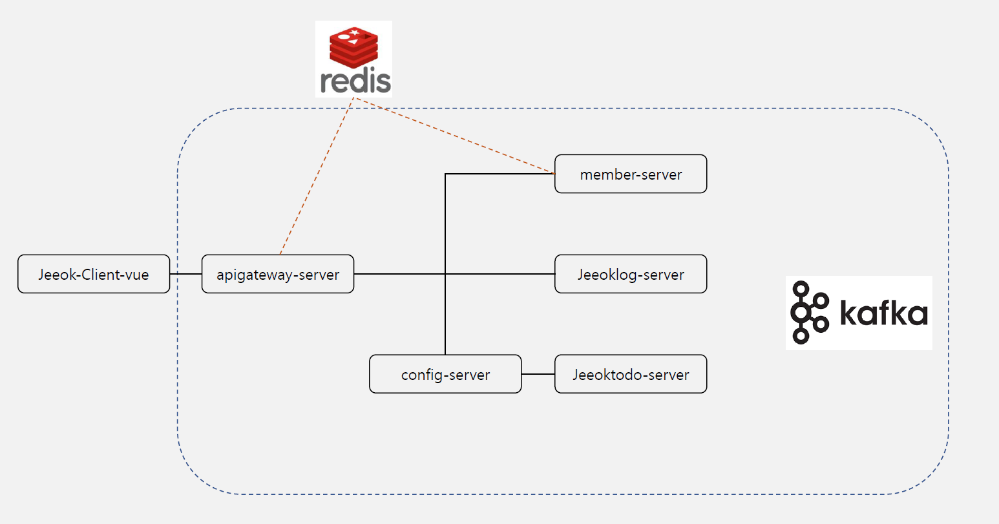

# [JEEOK-PROJECT] 공부한거 적용해하기

## rest api 서버
| 서버 | 설명 | 설계서 |
| --- | --- | --- |
| MEMBER-SERVER | 회원 관리 | [이동](https://github.com/heechul90/project-jeeok/tree/main/member-server) |
| JEEOKLOG-SERVER | 지옥로그 관리 | - |

## 아키텍처
| 기술스택 | 개발환경 |
| --- | --- |
| Spring Boot | - String Boot 2.7.x   - Java 11   - Gradle   - Spring Web Mvc   - Spring Security |
| Spring Cloud | - Eureka   - Gateway   Config |
| Authenticate | - JWT (Json Web Token) |
| ORM | - JPA   - Querydsl |
| Database | - MariaDB   - Redis |
| Test | - Spring RestDocs   - JUnit5 |

## 시스템 아키텍처

