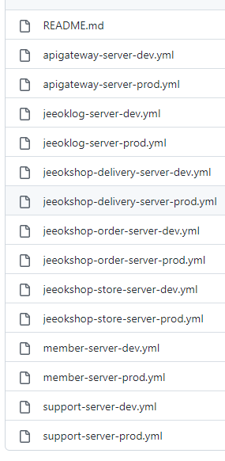

# JEEOK-CONFIG-SERVER
JEEOK-PROJECT 의 모든 환경에 대한 정보들을 관리해주는 중앙 서버

## 프로젝트 환경
| 기술 | 개발환경 |
| --- | --- |
| Spring Boot | - String Boot 2.7.5   - Java 11   - Gradle |
| Spring Cloud | - Config Server |

## repository
[[private 저장소]](https://github.com/heechul90/project-jeeok-config-repo)

- 참고 이미지

