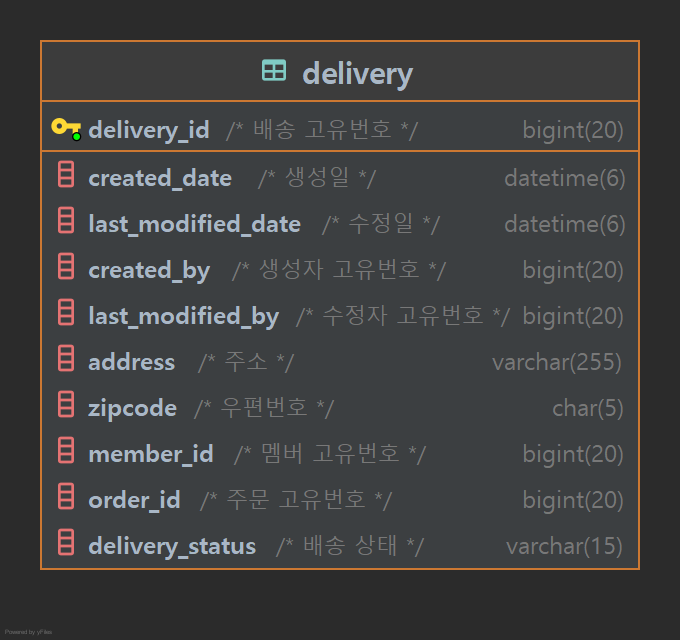

# JEEOKSHOP-DELIVERY-SERVER
주문과 동시에 배송이 저장된다. 
배송 상태를 업데이트 할 수 있고, 관리자는 배송관리를 할 수 있는 REST API 서버입니다.

## 프로젝트 환경
| 기술 | 개발환경 |
| --- | --- |
| Spring Boot | - String Boot 2.7.5   - Java 11   - Gradle |
| Spring Data | - String Data JPA |
| Spring Cloud | - Eureka Client   - Config Client   - OpenFeign |
| ORM | - JPA   - Querydsl |
| Database | - MariaDB |
| Test | - Spring RestDocs   - JUnit5   - Mock |
| Message Queue | - Kafka |

## API 문서
| 서비스 | 설계서 |
| --- | --- |
| JEEOKSHOP-DELIVERY-SERVER | [[링크]](https://heechul90.github.io/docs/api/jeeok-project/jeeokshop/order-server-API-%EB%AC%B8%EC%84%9C/index.html) |

## 데이터베이스 설계

## 기능
- 관리자 모드
  - 배송 목록 조회
  - 배송 단건 조회
  - 배송 저장
  - 배송 수정
  - 배송 시작
  - 배송 완료
  - 배송 취소
  - 배송 삭제
