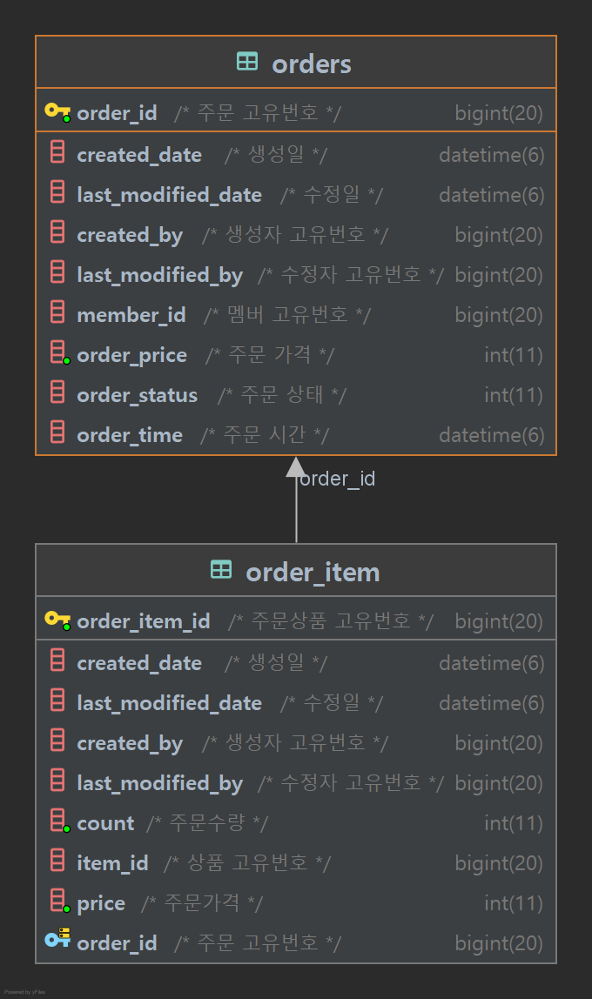

# JEEOKSHOP-ORDER-SERVER
주문 서버는 스토어에 있는 상품을 확인하고 사용자가 상품을 주문 할 수 있는 Rest APi 서버입니다.

## 프로젝트 환경
| 기술 | 개발환경 |
| --- | --- |
| Spring Boot | - String Boot 2.7.5   - Java 11   - Gradle |
| Spring Data | - String Data JPA |
| Spring Cloud | - Eureka Client   - Config Client   - OpenFeign |
| ORM | - JPA   - Querydsl |
| Database | - MariaDB |
| Test | - Spring RestDocs   - JUnit5   - Mock |
| Message Queue | - Kafka |
| Monitoring | - Spring Cloud Sleuth   - Zipkin |

## API 문서
| 서비스 | 설계서 |
| --- | --- |
| JEEOKSHOP-ORDER-SERVER | [[링크]](https://heechul90.github.io/docs/api/jeeok-project/jeeokshop/order-server-API-%EB%AC%B8%EC%84%9C/index.html) |

## 데이터베이스 설계

## 기능
- 사용자 모드
  - 내주문 목록 조회
  - 내주문 상세
  - 주문(주문시 delivery-server Delivery 저장)
  - 주문 취소(취소시 delivery-server DeliveryStatus 수정)
  - 주문 삭제
