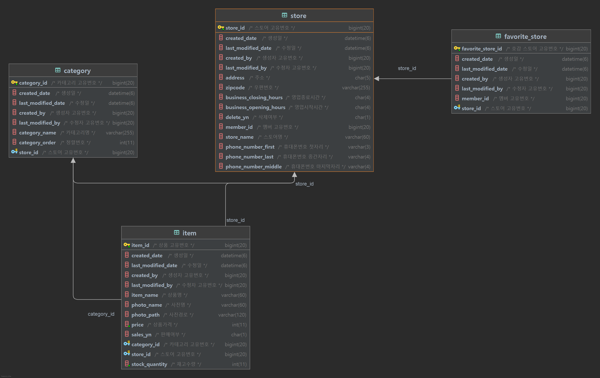

# JEEOKSHOP-STORE-SERVER
스토어 서버는 매니저, 관리자가 스토어를 관리 할 수 있으며, 카테고리 및 상품을 관리할 수 있고, 
사용자는 스토어를 확인하고 호감 있는 스토어를 추가 할 수 있는 Rest API 서버 입니다.

## 프로젝트 환경
| 기술 | 개발환경 |
| --- | --- |
| Spring Boot | - String Boot 2.7.5   - Java 11   - Gradle |
| Spring Data | - String Data JPA |
| Spring Cloud | - Eureka Client   - Config Client   - OpenFeign |
| ORM | - JPA   - Querydsl |
| Database | - MariaDB |
| Test | - Spring RestDocs   - JUnit5   - Mock |

## API 문서
| 서비스 | 설계서 |
| --- | --- |
| JEEOKSHOP-STORE-SERVER | [[링크]](https://heechul90.github.io/docs/api/jeeok-project/jeeokshop/store-server-API-%EB%AC%B8%EC%84%9C/index.html) |

## 데이터베이스 설계

## 기능
- 사용자 모드(일반 유저)
  - 스토어
    - 스토어 목록
    - 스토어 상세
  - 호감 스토어
    - 내 호감 스토어 목록
    - 내 호감 스토어 상세
    - 내 호감 스토어 추가
    - 내 호감 스토어 삭제
- 매니저 모드(매니저 권한)
  - 스토어
    - 내스토어 목록
    - 내스토어 상세
    - 내스토어 등록
    - 내스토어 수정
    - 내스토어 삭제
  - 상품
    - 내스토어 상품 목록
    - 내스토어 상품 상세
    - 내스토어 상품 등록
    - 내스토어 상품 수정
    - 내스토어 상품 삭제
- 관리자 모드(관리자 유저)
  - 스토어
    - 스토어 목록 조회
    - 스토어 단건 조회
    - 스토어 저장
    - 스토어 수정
    - 스토어 삭제
  - 상품
    - 상품 목록 조회
    - 상품 단건 조회
    - 상품 저장
    - 상품 수정
    - 상품 삭제
  - 카테고리
    - 카테고리 목록 조회
    - 카테고리 단건 조회
    - 카테고리 저장
    - 카테고리 수정
    - 카테고리 삭제