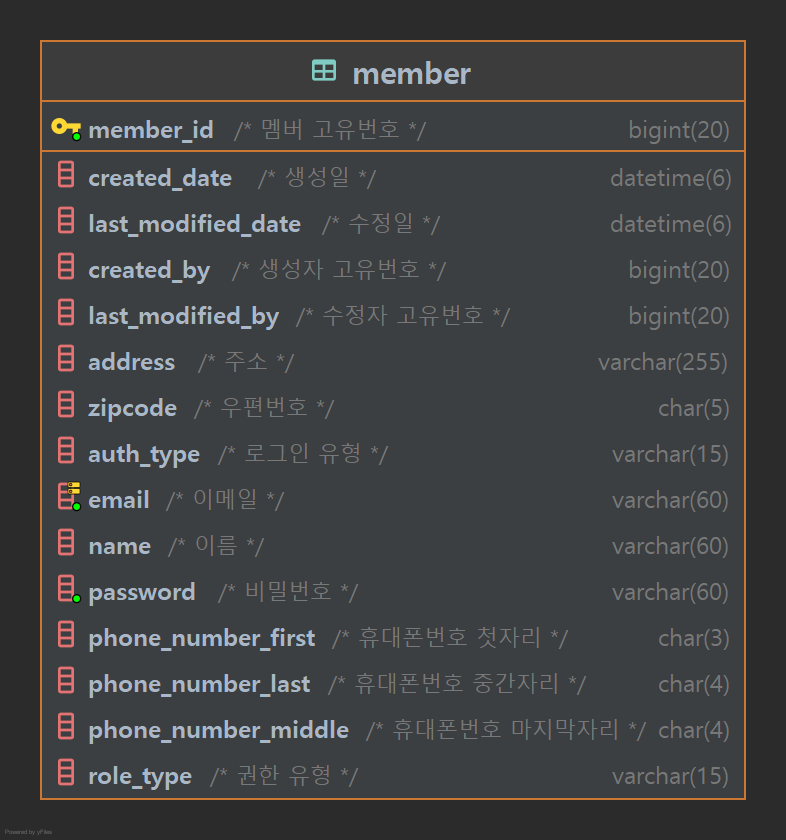

# MEMBER-SERVER
JEEOK-PROJECT 의 회원을 관리합니다. 
사용자(ROLE_USER), 매니저(ROLE_MANAGER), 배달원(ROLE_DELIVERYMAN), 관리자(ROLE_ADMIN) 으로 권한이 나뉘어져 있으며, 관리자는 모든 권한을 갖습니다.

## 프로젝트 환경
| 기술 | 개발환경 |
| --- | --- |
| Spring Boot | - String Boot 2.7.5   - Java 11   - Gradle |
| Spring Data | - String Data JPA |
| Spring Cloud | - Eureka Client   - Config Client |
| Authenticate | - JWT (Json Web Token) 0.11.2 |
| ORM | - JPA   - Querydsl |
| Database | - MariaDB   - Redis |
| Test | - Spring RestDocs   - JUnit5   - Mock |

## API 문서
| 서비스 | 설계서 |
| --- | --- |
| MEMBER-SERVER | [[링크]](https://heechul90.github.io/docs/api/jeeok-project/member/member-server-API-%EB%AC%B8%EC%84%9C/index.html) |

## 데이터베이스 설계

## 기능
- 회원 로그인
  - 회원가입
  - 로그인/로그아웃
  - 토큰 재발행
  - 토큰 조회
- 회원
  - 내 정보 조회
  - 내 정보 수정
- 회원 관리(관리자 권한)
  - 회원 목록 조회
  - 회원 단건 조회
  - 회원 저장
  - 회원 수정
  - 회원 삭제
